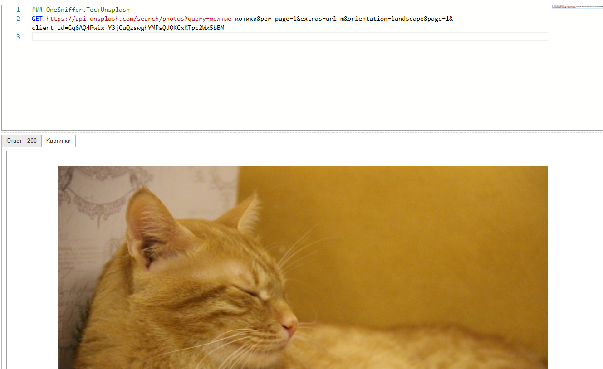
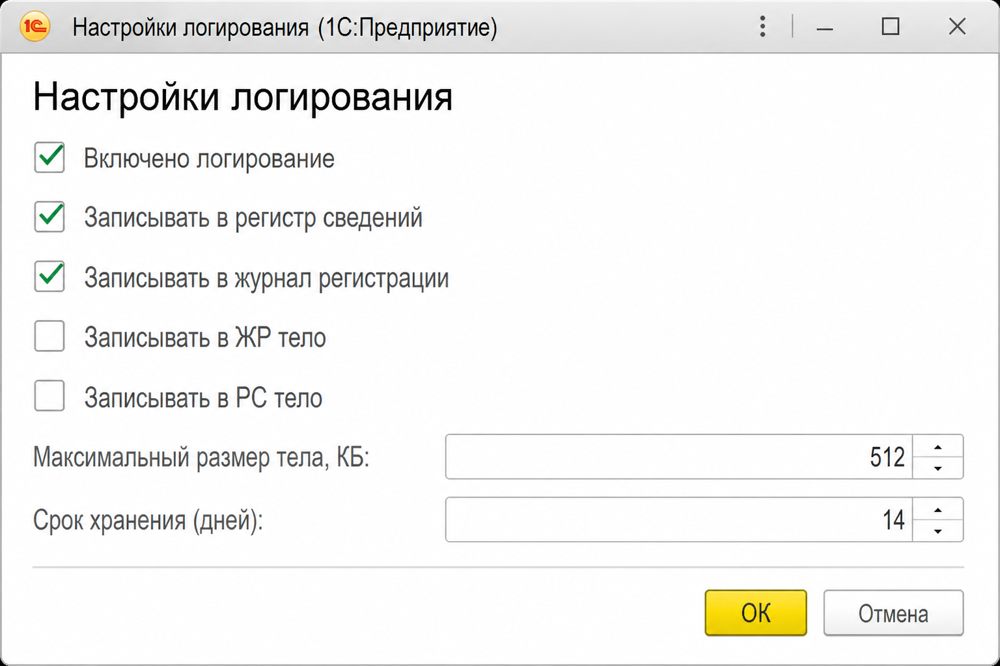

# OneSniffer: логирование HTTP-трафика в 1С:Предприятие 8

<!-- github-only:start -->
## Star History

<a href="https://www.star-history.com/?repos=ViktorErmakov%2FOneSniffer&type=date&legend=top-left">
 <picture>
   <source media="(prefers-color-scheme: dark)" srcset="https://api.star-history.com/chart?repos=ViktorErmakov/OneSniffer&type=date&theme=dark&legend=top-left" />
   <source media="(prefers-color-scheme: light)" srcset="https://api.star-history.com/chart?repos=ViktorErmakov/OneSniffer&type=date&legend=top-left" />
   
 </picture>
</a>
<!-- github-only:end -->

**OneSniffer** — расширение конфигурации 1С (тип AddOn, префикс `OneSniffer_`), сниффер HTTP внутри платформы: смотрите запрос и ответ в базе, повторяйте вызов, выгружайте curl / код 1С. Подходит, когда нельзя ставить стороннее ПО на сервер или рабочую станцию.

**Важно:** логируются только вызовы, которые вы **явно** перевели на API расширения. Автоматического перехвата всего HTTP платформы нет (opt-in).

Поддерживаются **исходящие** вызовы (`_HTTPСоединение._ВызватьHTTPМетод`) и **входящие** HTTP-сервисы (`_HTTPСервис.ЗаписатьВходящийЛог`).


https://infostart.ru/1c/tools/2747087/

## Требования

- Платформа и режим совместимости **8.3.14** и выше (минимальная версия, на которой инструмент проверялся)
- Расширение подключается к конфигурации-хосту как AddOn
- Для ЖР и фоновых заданий желательна **БСП** (`ОбщегоНазначения`, `ДлительныеОперации`, `Пользователи`)
- В режиме совместимости **8.3.14** при встраивании удалите константу `OneSniffer_ДатаЧтенияЖР` (константы в расширениях доступны с 8.3.16). На форме настроек укажите **Срок хранения** вручную и при необходимости нажмите **Выполнить сейчас**

## Быстрый старт

1. Подключите расширение к информационной базе.
2. Откройте **Логи трафика (OneSniffer)** — команда в интерфейсе или регистр `ЛогиТрафика`.
3. **Настройки логирования** → включите логирование и места хранения (РС и/или ЖР) → сохраните.
4. На форме списка: **Редактировать** → **Инструменты** → тестовый запрос → **Выполнить**.
5. Убедитесь, что запись появилась в списке (при записи только в ЖР — после импорта из журнала).


## Внедрение

### Исходящий HTTP

Найдите в коде хоста `HTTPСоединение.ВызватьHTTPМетод(...)`. Методы `Получить`, `Записать` и т.п. **не** перехватываются — сведите вызовы к `ВызватьHTTPМетод` или оберните только его.

Было:

```bsl
Ответ = HTTPСоединение.ВызватьHTTPМетод(HTTPМетод, HTTPЗапрос, ИмяВыходногоФайла);
```

Стало:

```bsl
Ответ = _HTTPСоединение._ВызватьHTTPМетод(
    HTTPСоединение, HTTPМетод, HTTPЗапрос, ИмяВыходногоФайла, ИмяСобытия); // ИмяСобытия — необязательно
```

При выключенном логировании обёртка вызывает платформу напрямую. Имена событий можно задать в `ЛогированиеТрафикаПереопределяемый.ИмяСобытия`.

### Входящий HTTP

В конце обработчика HTTP-сервиса:

```bsl
_HTTPСервис.ЗаписатьВходящийЛог(Запрос, ИмяСобытия, Ответ);
// опционально: передать ВремяНачалаЗамера (= ТекущаяУниверсальнаяДатаВМиллисекундах() в начале обработчика)
```

## Работа в пользовательском режиме

### Форма «Логи трафика»

| Действие | Назначение |
|----------|------------|
| Выполнить | Повтор лога текущей строки или отправка текста из редактора (в режиме правки) |
| Редактировать | Режим правки запроса (инструменты, тестовые запросы, экспорт кода) |
| Развернуть | Редактор запроса/ответа на весь экран |
| Сохранить / Загрузить логи | Экспорт и импорт markdown |
| Код curl / 1С | Генерация команды или фрагмента BSL |
| Настройки логирования | Параметры записи в РС и ЖР |

В тексте запроса: переменные `{{$guid}}`, `{{$time}}`, `{{Выражение}}`. Тела смотрите и правьте в Monaco (JSON / REST); картинки из ответа — на вкладке «Картинки».



### Настройки логирования



| Параметр | Описание |
|----------|----------|
| **Включено логирование** | Главный выключатель |
| **Записывать в ЖР / в РС** | Куда писать успешные вызовы (исключения в ЖР — всегда) |
| **Записывать тело (ЖР / РС)** | Тела запроса и ответа в выбранное хранилище |
| **Максимальный размер тела, КБ** | Лимит при записи (`0` — без лимита). Рекомендуется 256–1024 |
| **Получение исключений / ФЗ** | Импорт из ЖР в РС при открытии списка (синхронно или фоном) |
| **Дата чтения ЖР** | С какой даты читать журнал (константа `OneSniffer_ДатаЧтенияЖР`) |
| **Срок хранения** | Удаление записей старше N дней. `0` — автоочистка выключена. РЗ `OneSniffer_ОчисткаЛоговТрафика`: гиперссылка расписания и **Выполнить сейчас**. На 8.3.14 после удаления константы — срок вручную и «Выполнить сейчас» |

Заголовки `Authorization`, `Cookie`, `X-API-Key` при записи маскируются.

## Ограничения

1. **Opt-in** — без замены вызовов в хосте логов не будет.
2. Обёрнут только `HTTPСоединение.ВызватьHTTPМетод`.
3. AddOn не подписывается на чужие модули без правок хоста.
4. В логах могут оказаться чувствительные данные — не включайте запись тел на продуктиве без необходимости.

## Репозиторий

[github.com/ViktorErmakov/OneSniffer](https://github.com/ViktorErmakov/OneSniffer)

Справка в продукте собирается из этого файла: `.\tools\build-docs.ps1`. Обновление Monaco Editor: [`documentation/monaco-editor-update.md`](documentation/monaco-editor-update.md).
