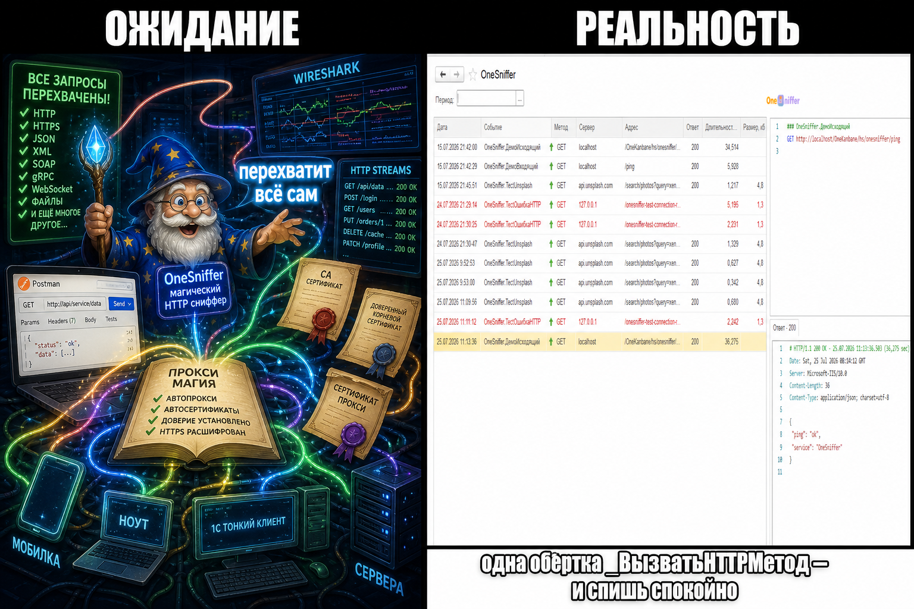
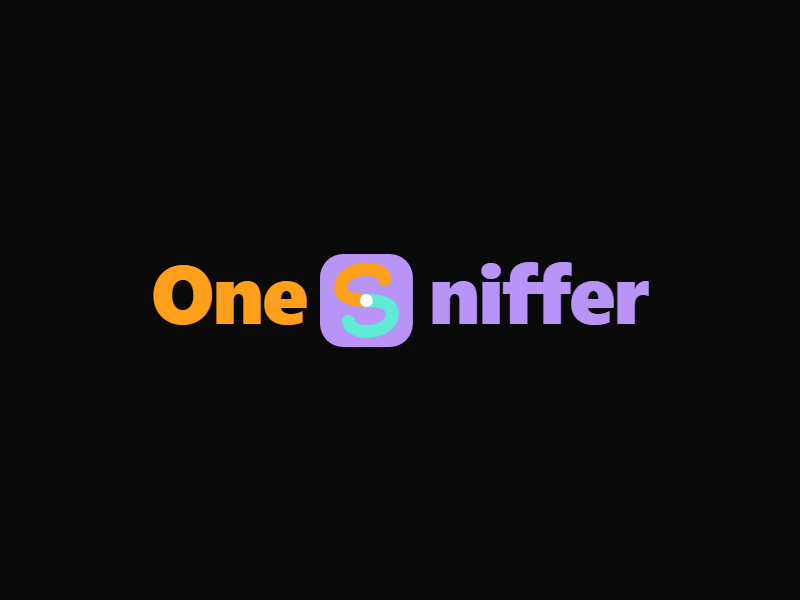
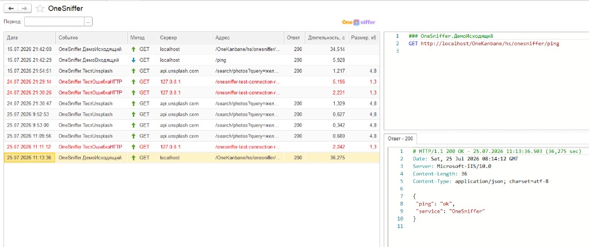
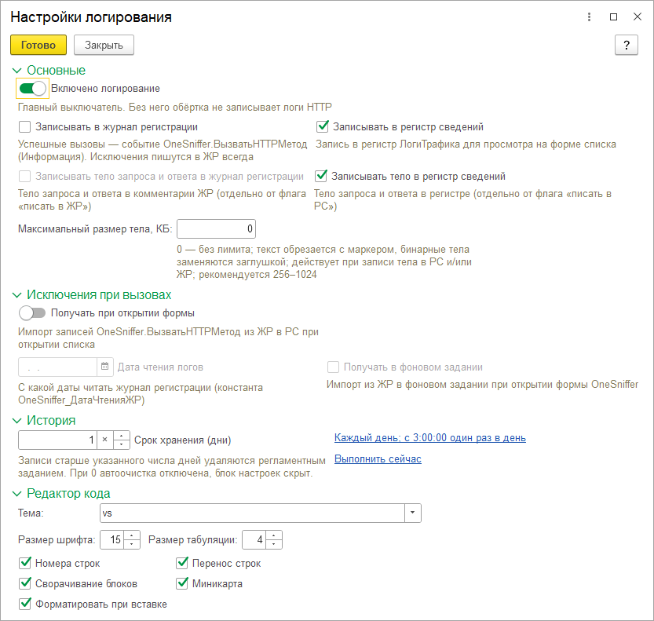
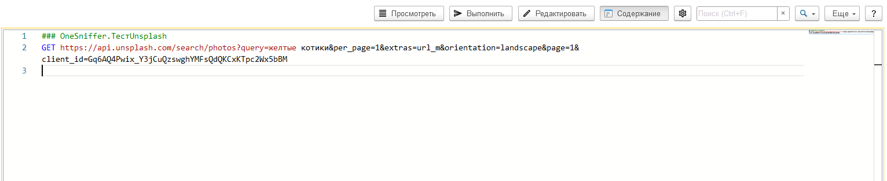

# OneSniffer: как мы устали ловить HTTP в 1С через ЖР и написали свой сниффер

> **Анонс (для поля «Краткое описание» на Infostart):**  
> Долго отлаживали интеграции через сообщения, журнал регистрации и чужие прокси. На проде это не взлетело. Собрали простой инструмент внутри платформы — смотришь запрос/ответ, повторяешь, выгружаешь curl. Версия 0.0.0.3 — можно ставить и пробовать.

> **Картинка анонса:** `docs/images/infostart/announce-logo.png` (или `logo-banner.png`)  
> **Файл публикации:** `Releases/OneSniffer_0.0.0.3.cfe`  
> **Теги:** HTTP, интеграция, отладка, расширение, логирование, сниффер  
> **Платформа:** 8.3.17+  
> **Репозиторий:** https://github.com/ViktorErmakov/OneSniffer

---

<!-- Ниже — основной текст публикации. Картинки загружать в блок «Изображения» Infostart, сюда — после загрузки. -->


Интеграция вчера отвечала 200. Сегодня — 400, таймаут или пустое тело. Клиент уже пишет в чат. Ты в Конфигураторе. Классика.


*Прод. Интеграция. Всё нормально.*

---

Сначала делали «как все». `Сообщить()`. Куски JSON в журнал регистрации. Временная `ЗаписьJSON` «на пять минут». Через неделю база орёт логами, а нужного тела ответа всё равно нет. Или есть — но не в том сеансе, не в том событии и без заголовков.


*Когда в ЖР нашёл всё, кроме тела ответа.*

---

Потом поставили Fiddler / Wireshark. На своей машине — красота. На сервере 1С — «нельзя ставить стороннее ПО», сертификаты, MitM, и всё равно непонятно, *какой* прикладной вызов это был. Прокси видит пакеты. Бизнес-контекст живёт в коде.


---

Нужен был не «ещё один Postman», а журнал трафика **там, где живёт код**: включил — увидел запрос и ответ — повторил — выгрузил curl. Без магии «перехватим всю базу сами». Честный opt-in: логируются только вызовы, которые вы сами перевели на API расширения.



*Ожидание: перехватит всё сам. Реальность: одна обёртка — и спишь спокойно.*

---

Так появился **OneSniffer** — расширение AddOn (префикс `OneSniffer_`), сниффер HTTP внутри 1С:Предприятие 8. Версия **0.0.0.3**.





*Список логов — входящие и исходящие рядом.*

Что умеет, коротко:

1. Исходящий HTTP через `_HTTPСоединение._ВызватьHTTPМетод`, входящий — через `_HTTPСервис`.
2. Список логов, настройки РС/ЖР, Monaco-редактор, повтор запроса с формы.
3. Экспорт markdown / curl / код 1С, маскирование `Authorization`, `Cookie`, `X-API-Key`.



*Включил логирование — выбрал, куда писать.*



*Поправил запрос — отправил снова — сравнил ответ.*

---

Важно: это не волшебная кнопка «сниффить всю конфигурацию». Заменил вызов на обёртку — получил лог. На проде не пишем лишнее, если не включили. Платформа **8.3.17+**, для ЖР и фоновых заданий лучше с БСП.

Было:

```bsl
Ответ = HTTPСоединение.ВызватьHTTPМетод(HTTPМетод, HTTPЗапрос, ИмяВыходногоФайла);
```

Стало:

```bsl
Ответ = _HTTPСоединение._ВызватьHTTPМетод(
    HTTPСоединение, HTTPМетод, HTTPЗапрос, ИмяВыходногоФайла, ИмяСобытия);
```


*Когда после одной замены вызова в списке наконец появился POST.*

---

Хватит читать ЖР как детектив.

**Скачай версию 0.0.0.3** (файл к публикации), подключи расширение, включи логирование, кинь тестовый запрос с формы списка — и посмотри, что ушло и что вернулось.

Исходники и обновления: [github.com/ViktorErmakov/OneSniffer](https://github.com/ViktorErmakov/OneSniffer)


---

## Обновления

### 0.0.0.3 — первая публикация на Infostart

- Исходящий HTTP через `_HTTPСоединение._ВызватьHTTPМетод`
- Входящий лог через `_HTTPСервис`
- Список логов, настройки РС/ЖР, повтор запроса, экспорт markdown / curl / 1С
- Monaco-редактор, маскирование чувствительных заголовков

<!-- Новые версии дописывать СВЕРХУ этого блока:

### 0.0.0.4 — ДД.ММ.ГГГГ
- …

-->
